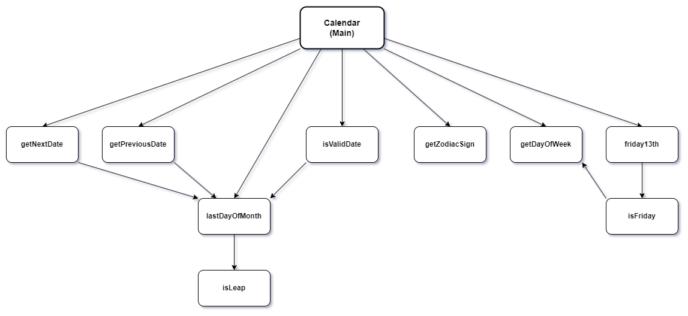

# SUBMISSION 

## PART 1 (40 points)
A-D are implemented in the code
E:

## PART 2 (20 points)

## PART 3 (20 points)

| Node | Unit Name       | Predecessors  | Successors    |
|------|-----------------|---------------|---------------|
| 1    | Main            | (None)        | 2,3,4,5,6,7,8 |
| 2    | isValidDate     |       1       |       7       |
| 3    | getNextDate     |       1       |       7       |
| 4    | getPreviousDate |       1       |       7       |
| 5    | getDayOfWeek    |      1,9      |     (None)    |
| 6    | getZodiacSign   |       1       |     (None)    |
| 7    | lastDayOfMonth  |    1,2,3,4    |       10      |
| 8    | friday13th      |       1       |       9       |
| 9    | isFriday        |       8       |       5       |
| 10   | isLeap          |       7       |     (None)    |

...

## PART 4 (20 points)

